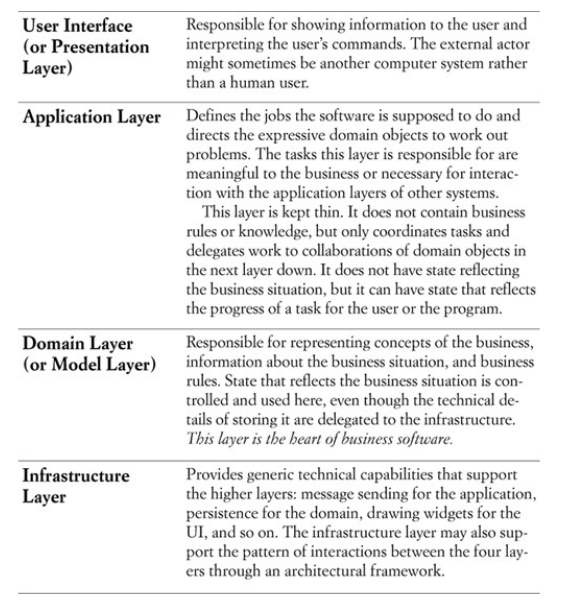
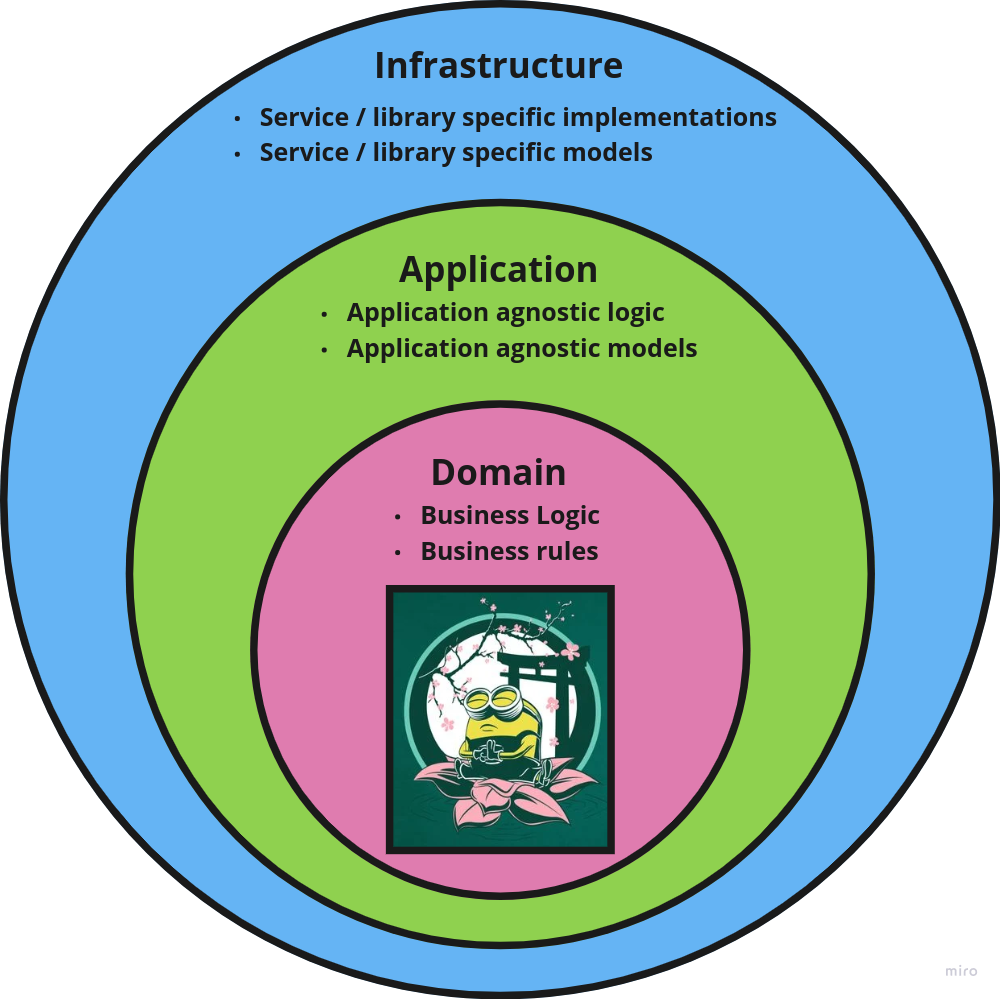

# Architecture overview

This document aims to explain the basics of this architecture proposal, motivations and links to more detailed docs.

## Description

This architecture is build on top of DDD layers and paterns and takes the concept of `Port` and `Adapter` from the hexagonal architecture. This proposal is focused on backend architectures and may contain specific patterns which do not fit on every project.

## Motivation

The current architecture is proposed in order to fulfill specific requirements:

1. As analyst I want a uniform project structure to reduce the complexity of designing a feature.
9. As analyst I want to design models regardless the restrictions of my integrated services.
2. As developer I want a set of common patterns to easily understand code pieces I've never developed.
3. As developer I want to easily upgrade or replace any third party services or dependencies I rely on. I expect the possibility of a soft transition in order to accomplish such tasks.
4. As developer I want to rely on abstractions rather than specific implementations.
5. As developer I want to assign single small responsibilities to my modules to keep them simple.
6. As developer I want to easily test my modules.
7. As developer I want to easily review my teammates code.
8. As developer I want to isolate my application business logic.
10. As developer I want to handle my application use cases.
12. As developer I want to avoid logic duplication without a good reason.

The current architecture is proposed for a solution providing a REST API, so the following requirements are also included.

1. As developer, I want to be able to provide multiple API versions of an specific endpoint to avoid client breaking changes and soft client transitions.

## Layers

Eric Evans proposes four layers for DDD based architectures:

For simplicity purposes, we will get rid of the presentation layer.

The remaining layers would be the following ones:

Keep in mind outer layers are aware of inner layers, but the opposite is not true. The application layer can perfectly use a domain model but it won't use an infrastructure service whatsoever.

- **Domain**: business logic and rules goes here. If an alcoholic drink has to contain at least an "alcohol" liquid, a business rule must reflect this rule in the domain layer. Domain layer does not know about databases nor APIs.

- **Application**: Application agnostic logic and models are included here. No business logic can ever be included here. The same applies to any specific service / library coupled module. This layer knows a persistence service exists and even knows a contract to request it to search for an entity, but it will never know if a CosmosDb SQL driver is accesing a CosmosDb database or maybe a third party REST API is used for the same purpose instead.

- **Infrastructure**: Application service / library specific logic and models are included here. Modules of this layer often implements contract established in inner layers.

Consider having a look to the different patterns involved in the project:

- [Custom patterns](./patterns/custom-patterns.md).
- [DDD patterns](./patterns/ddd/domain.md).
- [Hexagonal architecture patterns](./patterns/hex.md)