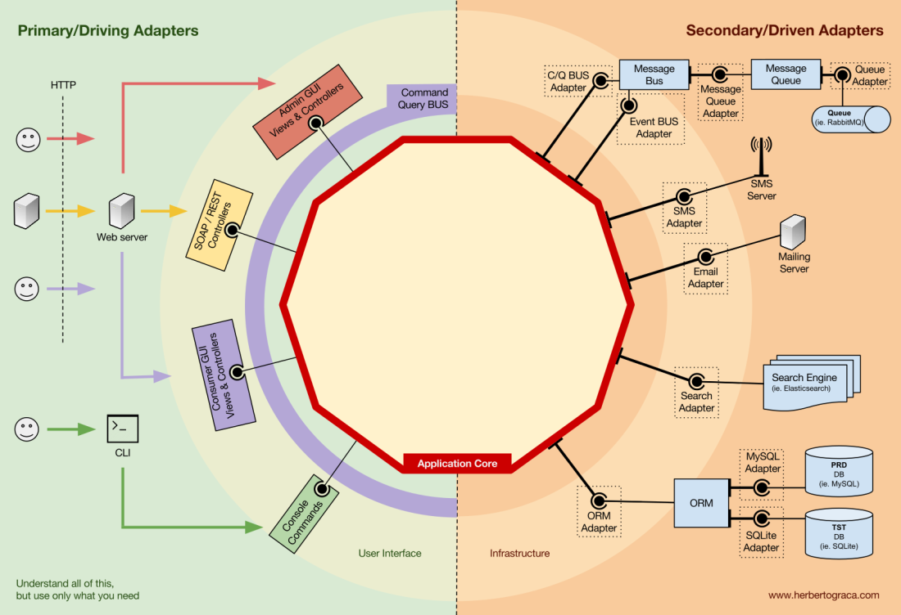

# Hexagonal architecture patterns used

## Ports

Represents a contract as an interface. We can distinguish between driving and driven ports.

### Driving ports

Describes contracts to interact with the application core.

### Driven ports

Describe contracts which allows the application core to establish interactions with other modules.

### Adapters

Represents the implementation of the previous contracts. Like ports we can distinguish between driving and driven adapters.
